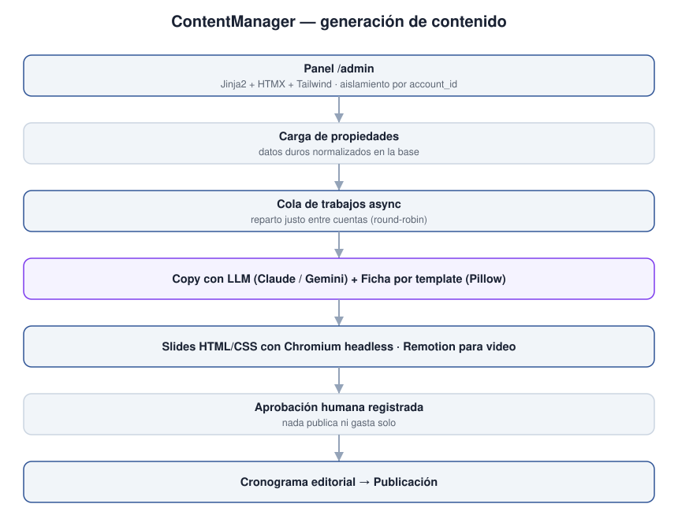
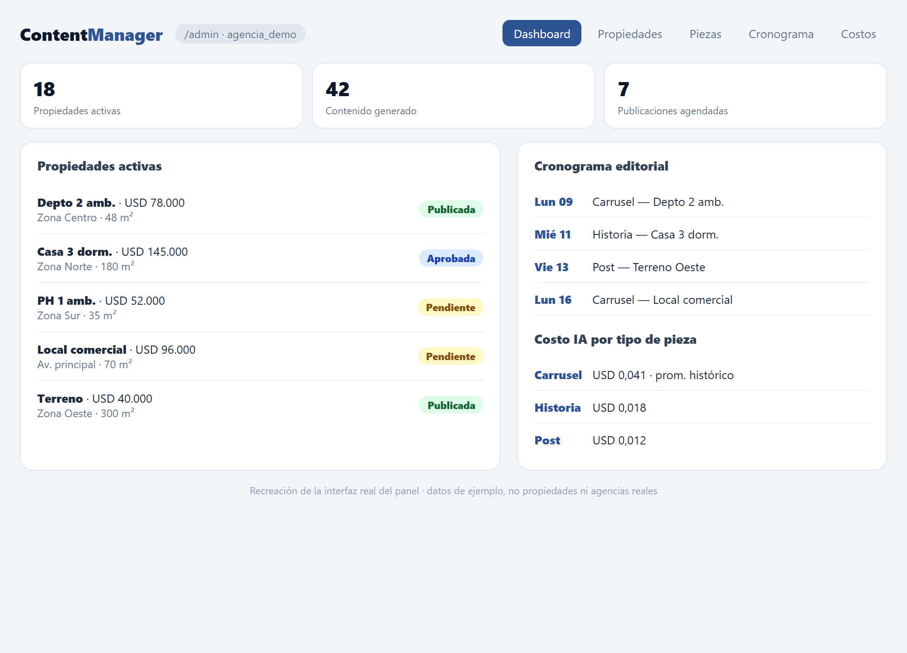

**🇦🇷 Español · 🇬🇧 [English](#-english)**

# ContentManager

> SaaS multi-inmobiliaria: cada agencia gestiona sus propiedades y genera contenido para redes, con aprobación humana antes de publicar.

**Este repositorio es una vitrina técnica, no el sistema.** El sistema en
producción es privado. Acá están la arquitectura, las decisiones de diseño, las
pruebas y algunos fragmentos de código elegidos para mostrar cómo está resuelto.

---

## El problema

Una inmobiliaria publica decenas de propiedades por mes en redes, y cada pieza
—precio, superficie, ambientes, zona— tiene que ser exacta: un dato mal puesto
es información comercial falsa a nombre de la agencia. Las herramientas de
generación con IA producen texto lindo pero alucinan datos duros, y ninguna
resuelve que varias agencias trabajen sobre el mismo sistema sin verse entre sí.

ContentManager es un panel multi-cuenta donde cada agencia carga sus propiedades,
genera piezas para redes (post, carrusel, historia), arma un cronograma editorial
y aprueba antes de publicar. La regla que atraviesa todo: los datos duros los
pone el sistema desde la base, nunca el modelo.

## Arquitectura



**Panel — recreación con datos de ejemplo / panel recreation with example data:**



```
Panel /admin (Jinja2 + HTMX + Tailwind, gráficos con Chart.js)
      │  cada request lleva account_id — aislamiento por cuenta
      ▼
Propiedades ──► Cola de trabajos async (reparto justo entre cuentas)
      │                    │
      │                    ▼
      │           Generación: LLM escribe el copy · template dibuja la ficha
      │                    │      (Claude / Gemini, routing por tarea)
      ▼                    ▼
Cronograma editorial ──► Aprobación humana ──► Publicación
```

Detalle en [`docs/arquitectura.md`](docs/arquitectura.md).

## Stack

| Capa | Tecnología | Por qué esta y no otra |
|---|---|---|
| Backend | Python · FastAPI | Async para la cola y los webhooks, un solo lenguaje |
| Base de datos | PostgreSQL sobre Supabase | Multi-tenant con Storage incluido |
| Interfaz | Jinja2 · HTMX · Tailwind · Chart.js | Panel reactivo sin construir una SPA |
| IA | Claude · Gemini | Routing de modelo por tarea, con costo medido |
| Imagen | Pillow · Chromium headless | Ficha determinística y slides HTML/CSS |
| Video | Remotion (React/TS) | Render de reels con plantilla |
| Despliegue | Docker · Railway | Imagen reproducible, deploy por rama |

## Decisiones de diseño

Detalle completo en [`docs/decisiones.md`](docs/decisiones.md).

### Ficha técnica determinística

- **Qué se hizo:** los datos duros de la propiedad se dibujan por template desde la base; el LLM no los escribe nunca.
- **Alternativa descartada:** pedirle al modelo que redacte la ficha completa.
- **Por qué:** una alucinación en precio, superficie o zona es información comercial y legal falsa publicada a nombre de la inmobiliaria.
- **Qué costó:** las fichas son más rígidas y menos "naturales" que un texto libre.

### La cola reparte por cuenta, no por orden de llegada

- **Qué se hizo:** round-robin con tope de workers por cuenta (`MAX_POR_CUENTA`).
- **Alternativa descartada:** FIFO — el más viejo primero.
- **Por qué:** una agencia que encolaba 40 piezas dejaba a las demás sin servicio.
- **Qué costó:** más estado que mantener y una cola más difícil de razonar; ver el bug de `count()` documentado en el snippet.

### Nada publica ni gasta sin confirmación humana

- **Qué se hizo:** toda pieza pasa por un estado de aprobación registrado antes de publicarse o gastar tokens.
- **Alternativa descartada:** un modo totalmente automático.
- **Qué costó:** hay un humano en el camino crítico; el sistema no escala solo.

## Decisiones sobre este repositorio

- **Es una vitrina, no un espejo.** El sistema en producción tiene material de clientes: nombres de agencias, propiedades reales, cuentas de Instagram. Publicarlo entero no era una opción.
- **Se publica lo que se lee, no lo que pesa.** `app/panel/routes.py` tiene 4288 líneas; no aporta a quien evalúa en cinco minutos. En su lugar van fragmentos elegidos, uno por decisión.
- **Los tests sí van completos.** Cuatro de las 18 suites reales, las que mejor muestran el criterio: aislamiento entre cuentas, cola justa, costos y cuotas.
- **Los nombres de cliente están reemplazados** por ficticios (`cliente_demo`), no ofuscados.

## Qué hay en este repositorio

| Carpeta | Qué contiene |
|---|---|
| [`docs/`](docs/) | Arquitectura, decisiones y capturas |
| [`snippets/`](snippets/) | Cuatro fragmentos comentados, uno por decisión |
| [`tests/`](tests/) | Cuatro de las 18 suites reales del proyecto |

Los fragmentos de `snippets/` no forman un programa ejecutable: están para leerse.

## Escala del proyecto

137 commits · 61 módulos Python · 43 vistas · 18 suites de test · multi-tenant
con aislamiento por cuenta. En desarrollo activo desde julio de 2026.

## Estado

En desarrollo activo. Repositorio de producción privado.

---

## Código completo

El repositorio de producción es privado porque contiene material de clientes.
Puedo dar acceso de lectura durante un proceso de selección: escribime a
**mario1804.dev@gmail.com**.

## Licencia

Todos los derechos reservados. Ver [`LICENSE`](LICENSE).

---

<a name="english"></a>
# 🇬🇧 English

# ContentManager

> Multi-agency real-estate SaaS: each agency manages its listings and generates social content, with human approval before publishing.

**This repository is a technical showcase, not the system.** The production
system is private. Here you'll find the architecture, the design decisions, the
tests, and a few code snippets chosen to show how it's built.

## The problem

A real-estate agency publishes dozens of listings a month on social media, and
each piece —price, area, rooms, location— has to be exact: one wrong figure is
false commercial information under the agency's name. AI generation tools produce
nice text but hallucinate hard data, and none solve several agencies working on
the same system without seeing each other.

ContentManager is a multi-account panel where each agency loads its listings,
generates social pieces (post, carousel, story), builds an editorial calendar
and approves before publishing. The rule that runs through everything: hard data
comes from the database, never from the model.

## Architecture


Full detail in [`docs/arquitectura.md`](docs/arquitectura.md).

## Stack

| Layer | Technology | Why this and not another |
|---|---|---|
| Backend | Python · FastAPI | Async for the queue and webhooks, one language |
| Database | PostgreSQL on Supabase | Multi-tenant with Storage included |
| Interface | Jinja2 · HTMX · Tailwind · Chart.js | Reactive panel without building an SPA |
| AI | Claude · Gemini | Per-task model routing, with measured cost |
| Image | Pillow · headless Chromium | Deterministic spec sheet and HTML/CSS slides |
| Video | Remotion (React/TS) | Reel render from a template |
| Deployment | Docker · Railway | Reproducible image, per-branch deploy |

## Design decisions

Full detail in [`docs/decisiones.md`](docs/decisiones.md).

### Deterministic spec sheet

- **What:** the listing's hard data is drawn by template from the database; the LLM never writes it.
- **Rejected alternative:** ask the model to write the whole spec sheet.
- **Why:** a hallucination in price, area or location is false commercial and legal information published under the agency's name.
- **Cost:** spec sheets are more rigid and less "natural" than free text.

### The queue dispatches per account, not first-come-first-served

- **What:** round-robin with a per-account worker cap (`MAX_POR_CUENTA`).
- **Rejected alternative:** FIFO — oldest first.
- **Why:** an agency enqueuing 40 pieces left the others without service.
- **Cost:** more state to keep and a harder queue to reason about; see the `count()` bug documented in the snippet.

### Nothing publishes or spends without human approval

- **What:** every piece goes through a recorded approval state before publishing or spending tokens.
- **Rejected alternative:** a fully automatic mode.
- **Cost:** there's a human on the critical path; the system doesn't scale on its own.

## Decisions about this repository

- **It's a showcase, not a mirror.** The production system holds client material: agency names, real listings, Instagram accounts. Publishing it whole wasn't an option.
- **What's published is what reads, not what weighs.** `app/panel/routes.py` is 4288 lines; it adds nothing for a five-minute evaluation. In its place go chosen snippets, one per decision.
- **The tests ship in full.** Four of the 18 real suites, the ones that best show the criteria: cross-account isolation, fair queue, costs and quotas.
- **Client names are replaced** with fictional ones (`cliente_demo`), not obfuscated.

## What's in this repository

| Folder | Contents |
|---|---|
| [`docs/`](docs/) | Architecture, decisions and screenshots |
| [`snippets/`](snippets/) | Four commented snippets, one per decision |
| [`tests/`](tests/) | Four of the project's 18 real suites |

The `snippets/` fragments don't form a runnable program: they're meant to be read.

## Project scale

137 commits · 61 Python modules · 43 views · 18 test suites · multi-tenant with
per-account isolation. In active development since July 2026.

## Status

In active development. Production repository private.

## Full code

The production repository is private because it contains client material. I can
grant read access during a hiring process: write me at **mario1804.dev@gmail.com**.

## License

All rights reserved. See [`LICENSE`](LICENSE).
